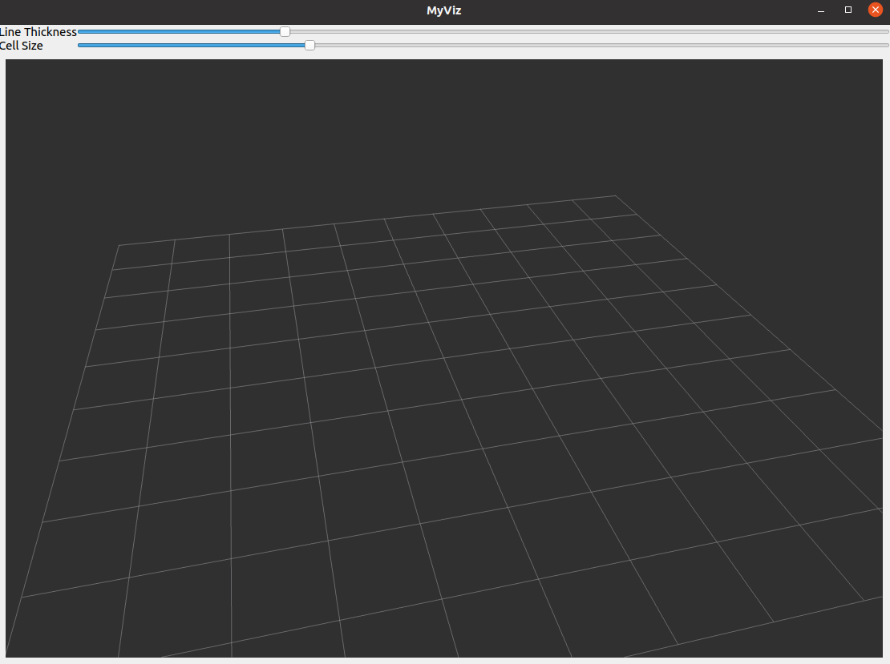

# Custom_Qt5_Rviz2
In this repository is an example on how to implement the `RenderPanel` of [`rviz2`](https://github.com/ros2/rviz). This is a workaround and it's not the best solution but it's the only way I found to work.
The two repositories are for distribution `ros2 foxy`.
For this to work, I made a small changes to the `rviz` source code, these can be found on my [fork](https://github.com/MartiBolet/rviz).
This example tries to be an ROS2 version of this [tutorial](http://docs.ros.org/en/indigo/api/librviz_tutorial/html/index.html#).


## Compile & run
To compile the project:
```
cd $HOME
mkdir myviz_ws && cd myviz_ws
git clone https://github.com/MartiBolet/rviz
git clone https://github.com/MartiBolet/Custom_Qt5_Rviz2
cd rviz
git checkout -b develop_integration_with_qt origin/develop_integration_with_qt

# Build
cd $HOME/myrviz_ws
colcon build --symlink-install
# Install
source ./install/setup.bash
```
> After compile rviz for first time, you can add `COLCON_IGNORE` files inside the individual packages of `rviz` to dont recompile all when you make a small change.

To run the window:
```
ros2 run myviz myviz
```


## Error `libGL error: failed to create drawable`
If there is an error like `libGL error: failed to create drawable` and the `RenderPanel` doesn't show anything, try to:
```
export LIBGL_ALWAYS_SOFTWARE=1
```
From this [answer](https://answers.ros.org/question/286985/libgl-error-failed-to-create-drawable/) and this [tutorial](http://wiki.ros.org/rviz/Troubleshooting)

## Contributors:
Co-workers: [@albertarla](https://github.com/albertarla), [@iggyrrieta](https://github.com/iggyrrieta).
All contributions are welcome and open to discussion.

## Known issues
* When you close the MainWindow with the 'cross' the terminal executing doesn't finish the program.
* The `Grid` doesn't change color to yellow or the thickness.
+ The connect functions from `QSlider` makes the program stop without any error.

## License
Apache License 2.0
