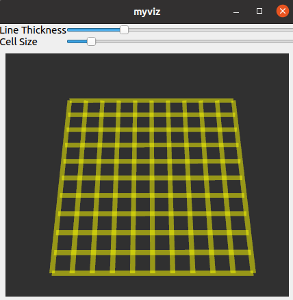

# Custom_Qt5_Rviz2
In this repository there is an example of how to implement the `RenderPanel` of [`rviz2`](https://github.com/ros2/rviz). This is a workaround and it's not the best solution but it's the only way I found that work.
The two repositories are for distribution `ros2 foxy`.
For this to work, I made a small changes to the `rviz` source code, these can be found on my [fork](https://github.com/MartiBolet/rviz).
This example tries to be a ROS2 version of this [tutorial](http://docs.ros.org/en/indigo/api/librviz_tutorial/html/index.html#).




## Compile & run

To compile the project:
```bash
cd $HOME
# Download
mkdir myviz_ws && cd myviz_ws
git clone https://github.com/MartiBolet/rviz
git clone https://github.com/MartiBolet/Custom_Qt5_Rviz2
cd rviz
git checkout -b develop_integration_with_qt origin/develop_integration_with_qt
# Build
cd $HOME/myviz_ws
colcon build
# Install
source ./install/setup.bash
```
> **TIP when testing**: After compiling rviz for the first time, you can add `COLCON_IGNORE` files inside the individual rviz packages. This will allow you to not recompile all when you make a small change.


Run:

```
ros2 run myviz myviz
```


## Error `libGL error: failed to create drawable`

If there is an error like `libGL error: failed to create drawable` and the `RenderPanel` doesn't show anything, try to:
```
export LIBGL_ALWAYS_SOFTWARE=1
```
From this [answer](https://answers.ros.org/question/286985/libgl-error-failed-to-create-drawable/) and this [tutorial](http://wiki.ros.org/rviz/Troubleshooting)


## Known issues

- When you close the MainWindow from Qt cross icon, it is not properly closed and needs to be killed from terminal.


## Contributors:

Co-workers: [@albertarla](https://github.com/albertarla), [@iggyrrieta](https://github.com/iggyrrieta).
All contributions are welcome and open to discussion.


## License
Apache License 2.0
